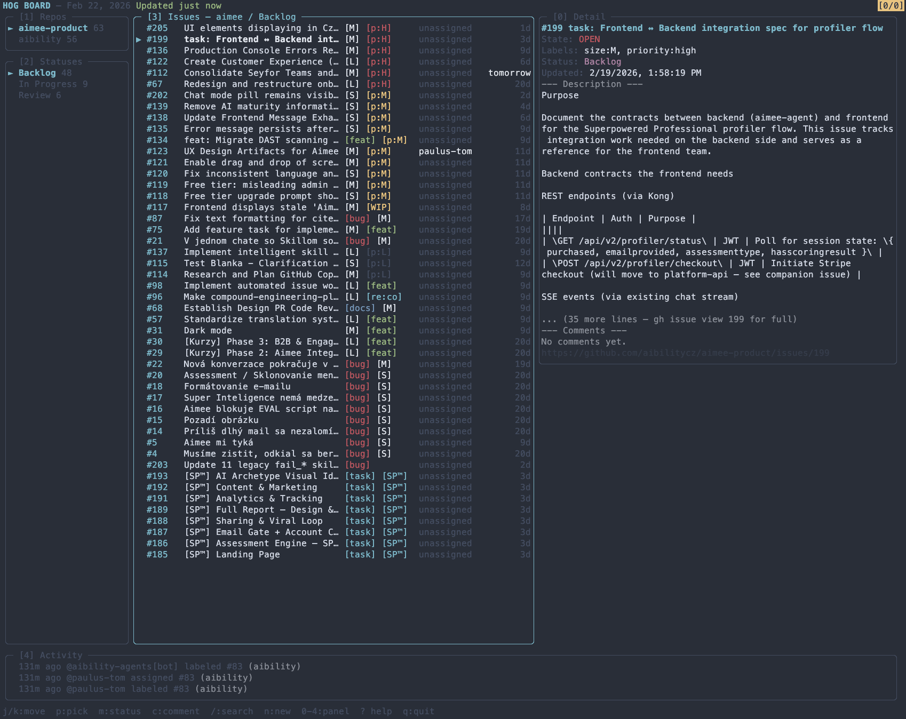

# hog

[](https://github.com/ondrej-svec/hog/actions/workflows/ci.yml)
[](https://www.npmjs.com/package/@ondrej-svec/hog)
[](https://opensource.org/licenses/MIT)
[](https://nodejs.org)

**A lazygit-style terminal dashboard for GitHub Issues.** Keyboard-driven, single-line rows, no context switching.



---

## What it does

`hog board --live` opens a five-panel TUI that shows all your GitHub Project issues across repos. Navigate with `j`/`k`, pick up issues, change statuses, comment, search, and open details — without ever touching a browser.

The layout is inspired by [lazygit](https://github.com/jesseduffield/lazygit): a narrow left column for repos and statuses, a wide issues list in the middle, a detail panel on the right, and an activity feed at the bottom.

---

## Quick Start

```sh
npm install -g @ondrej-svec/hog
hog init        # interactive setup (picks up gh auth automatically)
hog board --live
```

**Requirements:** [Node.js 22+](https://nodejs.org) and the [GitHub CLI](https://cli.github.com/) authenticated via `gh auth login`.

---

## Panel Layout

```
┌──────────────┬─────────────────────────────────┬──────────────────┐
│ [1] Repos    │ [3] Issues                      │ [0] Detail       │
│ [2] Statuses │  (main panel, full issue list)  │  (selected item) │
└──────────────┴─────────────────────────────────┴──────────────────┘
│ [4] Activity                                                       │
└────────────────────────────────────────────────────────────────────┘
```

Switch between panels with `0`–`4`. The detail panel and activity feed only appear on wider terminals (≥120 cols and ≥140 cols respectively).

---

## Features

### Issue list

Each issue fits on a single line with fixed-width columns:

```
▶ #199   Frontend ↔ Backend integration spec…  [M] [p:H]  unassigned      3d
  #205   UI elements displaying in Cz…         [M] [p:H]  unassigned      1d
```

| Column | Width | Content |
|--------|-------|---------|
| Cursor | 2 | `▶` when selected |
| Number | 7 | `#1234` |
| Title | dynamic | truncated to fit panel width |
| Labels | 13 | up to 2 compact abbreviations: `[bug]`, `[p:H]`, `[M]`, `[WIP]` |
| Assignee | 10 | login or `unassigned` |
| Date | 10 | target date (`today`, `in 4d`, `3d overdue`) or age (`2h`, `5m`) |

Labels are abbreviated automatically: `size:M` → `[M]`, `priority:high` → `[p:H]`, `work:*` → `[WIP]`, `enhancement` → `[enh]`.

### Navigation

| Key | Action |
|-----|--------|
| `j` / `k` | Down / up |
| `↓` / `↑` | Down / up |
| `Tab` / `Shift+Tab` | Next / previous section |
| `0`–`4` | Jump to panel |
| `Space` | Toggle section collapse (on header) or enter multi-select (on issue) |
| `Enter` | Open in browser (issue) or toggle collapse (section) |
| `C` | Collapse all sections |
| `?` | Toggle help overlay |
| `q` | Quit |

### Issue actions

| Key | Action |
|-----|--------|
| `p` | Pick up issue — assign to yourself + optional TickTick task |
| `a` / `u` | Assign / unassign collaborator |
| `m` | Change project status |
| `l` | Add / remove labels |
| `c` | Add comment |
| `ctrl+e` | Open `$EDITOR` for a multi-line comment |
| `y` | Copy issue URL to clipboard |
| `n` | Create issue (form wizard) |
| `I` | Create issue from natural language |
| `f` | Focus mode (Pomodoro timer) |

### Board controls

| Key | Action |
|-----|--------|
| `/` | Search issues by title |
| `r` / `R` | Refresh now |

### Multi-select

Press `Space` on any issue to enter multi-select, then:

| Key | Action |
|-----|--------|
| `Space` | Toggle item |
| `Enter` / `m` | Bulk action menu (status, assign, label) |
| `Escape` | Exit multi-select |

Multi-select is constrained to a single repo (GitHub API requirement).

---

## Natural Language Issue Creation

Press `I` to open the natural language input. Type a plain-English description:

```
fix auth timeout on mobile #backend #bug @alice due friday
```

hog extracts:

| Field | Token | Example |
|-------|-------|---------|
| Labels | `#word` | `#backend`, `#bug` |
| Assignee | `@user` | `@alice`, `@me` |
| Due date | `due <expr>` | `due friday`, `due end of month`, `due 2026-03-01` |
| Title | everything else | `fix auth timeout on mobile` |

A live preview shows the parsed fields before you confirm with `Enter`. Labels are validated against the repo's actual label list.

### LLM enhancement (optional)

With an [OpenRouter](https://openrouter.ai) API key, hog sends ambiguous input to an LLM for richer title cleanup. Heuristic tokens always take priority — LLM only fills gaps.

```sh
hog config ai:set-key sk-or-...   # store key
hog config ai:clear-key            # remove
hog config ai:status               # show active provider
```

Or use environment variables (take priority over stored key):

```sh
export OPENROUTER_API_KEY=sk-or-...
# or
export ANTHROPIC_API_KEY=sk-ant-...
```

---

## Commands

### `hog board`

```sh
hog board --live                    # interactive TUI
hog board --json                    # full board as JSON
hog board --mine --json             # only my assigned issues
hog board --backlog --json          # only unassigned issues
hog board --repo owner/repo --json  # filter by repo
hog board --profile work --live     # use a named profile
```

### `hog issue`

```sh
hog issue create "fix login bug #backend due friday" --repo owner/repo
hog issue create "add dark mode" --repo owner/repo --dry-run   # preview
hog issue create "add dark mode" --repo owner/repo --json      # structured output
```

### `hog pick`

Assign an issue to yourself and optionally create a linked TickTick task.

```sh
hog pick owner/repo/145
```

### `hog task`

Manage TickTick tasks (requires TickTick to be enabled).

```sh
hog task list
hog task add "Ship the feature"
hog task add "Bug fix" -p high -t "urgent"
hog task complete <taskId>
hog task update <taskId> --title "New title" -p medium
hog task delete <taskId>
hog task projects                   # list TickTick projects
hog task use-project <projectId>    # set default project
```

### `hog config`

```sh
hog config show

# Repos
hog config repos
hog config repos:add owner/repo --project-number 1 --status-field-id PVTSSF_xxx --completion-type closeIssue
hog config repos:rm reponame

# TickTick
hog config ticktick:enable
hog config ticktick:disable

# AI
hog config ai:set-key sk-or-...
hog config ai:clear-key
hog config ai:status

# Profiles
hog config profile:create work
hog config profile:delete work
hog config profile:default work
```

### `hog init`

Interactive setup. Detects your GitHub user, discovers your repos and project IDs, and optionally configures TickTick and an AI key.

```sh
hog init            # first-time setup
hog init --force    # overwrite existing config
```

### `hog sync`

Sync GitHub issue status with TickTick task completion.

```sh
hog sync run            # run sync
hog sync run --dry-run  # preview
hog sync status         # show current mappings
```

---

## Configuration

Config: `~/.config/hog/config.json` (created by `hog init`, schema version 3).

```jsonc
{
  "version": 3,
  "repos": [
    {
      "name": "owner/repo",
      "shortName": "repo",
      "projectNumber": 1,
      "statusFieldId": "PVTSSF_xxx",
      "completionAction": { "type": "closeIssue" },
      "statusGroups": ["In Progress", "In Review", "Todo,Backlog"]  // optional
    }
  ],
  "board": {
    "refreshInterval": 60,   // seconds (min 10)
    "backlogLimit": 20,
    "assignee": "your-github-login",
    "focusDuration": 1500    // seconds (25 min default)
  },
  "ticktick": {
    "enabled": false         // set true to enable TickTick sync
  },
  "profiles": {},
  "defaultProfile": ""
}
```

Credentials (TickTick OAuth token, OpenRouter key) live in `~/.config/hog/auth.json` with `0600` permissions.

### Status groups

hog auto-detects status columns from your GitHub Project. Override per-repo with `statusGroups`:

```json
"statusGroups": ["In Progress", "In Review", "Todo,Backlog"]
```

Each entry becomes a board section. Comma-separated values merge into one section (header = first value). Terminal statuses (Done, Shipped, Closed, etc.) are always hidden.

### Profiles

Switch board configs for different contexts:

```sh
hog config profile:create work
hog config profile:default work
hog board --profile personal --live
```

---

## Agent-friendly

Every command supports `--json` for structured output. This makes hog scriptable and usable by AI agents:

```sh
hog board --mine --json | jq '.issues[] | select(.labels[] | .name == "bug")'
hog issue create "fix login bug #backend @alice due friday" --repo owner/repo --json
```

---

## How it works

- **GitHub data** — always synchronous via `execFileSync("gh", ...)`. No GitHub tokens or REST API calls; `gh` CLI handles auth.
- **TickTick data** — async HTTP via the TickTick Open API. OAuth token stored in `auth.json`.
- **Rendering** — [Ink](https://github.com/vadimdemedes/ink) (React for CLIs). Each panel is an Ink component; rows are pre-truncated in JS so Ink never wraps text.
- **Auto-refresh** — `setInterval` re-fetches in the background; age indicator turns yellow (>2 min) then red (>5 min).

---

## Contributing

```sh
git clone https://github.com/ondrej-svec/hog
cd hog
npm install
npm run dev -- board --live    # run from source
npm run test                   # vitest
npm run ci                     # typecheck + lint + tests (what CI runs)
```

**Toolchain:** TypeScript (strict), [Biome](https://biomejs.dev/) for lint/format, [tsup](https://tsup.egoist.dev/) for bundling, [Vitest](https://vitest.dev/) for tests. 80% coverage threshold enforced.

Filenames must be `kebab-case`. `noExplicitAny` is an error. Use `import type` for type-only imports.

Run a single test file:

```sh
npx vitest run src/board/components/issue-row.test.tsx
```

---

## Requirements

- **Node.js 22+**
- **GitHub CLI** (`gh`) — authenticated via `gh auth login`
- **TickTick account** — optional
- **OpenRouter API key** — optional, for AI-enhanced issue creation

---

## License

MIT
